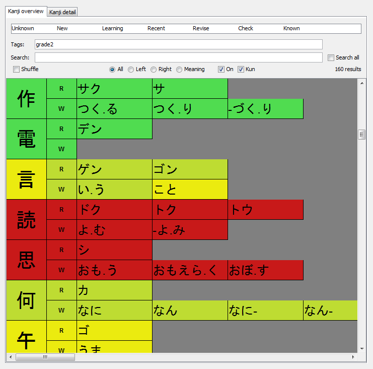
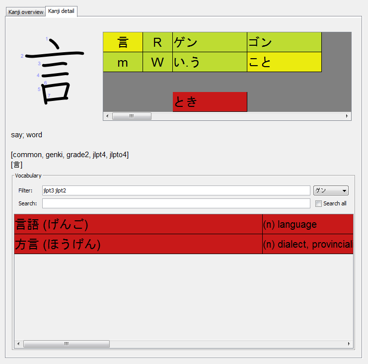

# KanjiFocus

KanjiFocus is a kanji learning application based on spaced repetition.

KanjiFocus is written in Java, has a Swing-based UI, uses SQLite to store kanji, vocabulary, and user data, and uses
Maven for project management.

 

Please see `COPYING.txt` for third-party license information and conditions.

## Overview

The UI implementation is based on the MVC framework. The main functionality of the UI is realized via tables, one for
the kanji overview and one for the kanji detail tag, each with their own Models and CellRenderers.

A separate project is used to populate `res/data.db`. Data sources used to populate this file along with their license
information are mentioned in `COPYING.txt`.
